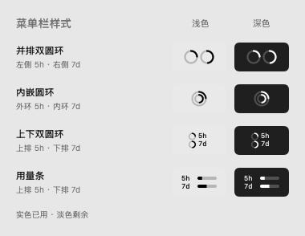
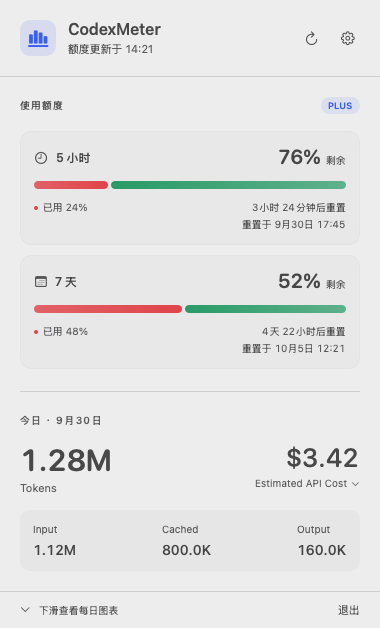

# CodexMeter

精简原生 macOS 菜单栏仪表盘，使用 Swift、SwiftUI、Swift Charts 和 AppKit。macOS 14+，无第三方依赖、后端或数据库。

- 菜单栏提供并排双圆环、内嵌圆环、上下双圆环和用量条，默认并排双圆环。实色表示已使用，淡色轨道表示剩余；模板图标由系统着色，自动适配深浅菜单栏和按下状态，悬停显示数字和重置时间。设置中可切换样式、查看实时预览，选择会自动保存。
- 点击默认打开仪表盘：首屏高度按「额度 + 今日 Token」区域自动计算。每日图表和周期汇总通过向下滚动查看；重新打开后回到顶部。额度卡片使用柔和配色的圆角分段条，展示今日 Input / Cached / Output / Total，以及 Estimated API Cost 明细。弹框打开时不默认聚焦设置按钮，仍可用 Tab 导航。
- 每日 Token 柱状图，支持 7 / 14 / 30 天；悬停查看每日明细，底部显示周期汇总。
- 自动刷新（默认 5 分钟）、手动刷新、睡眠唤醒后刷新。
- 设置包含登录时启动、刷新间隔、菜单栏显示模式、费用开关与 Codex CLI 路径。

## 界面预览

以下预览由当前版本的原生视图渲染，额度、Token 和费用使用示例数据。

**菜单栏**：并排双圆环为左侧 5h、右侧 7d；内嵌圆环为外环 5h、内环 7d；上下双圆环和用量条为上排 5h、下排 7d。也可仅显示 5h，缺少额度数据时显示虚线。



**弹框首屏**：展示 5 小时 / 7 天额度、今日 Token 和估算费用；额度卡片同时显示倒计时和本机时区的具体重置日期、时间，下滑可查看每日图表。



## 下载与安装

在 [GitHub Releases](https://github.com/7cater/CodexMeter/releases) 下载最新应用压缩包，解压后将 `CodexMeter.app` 放入 `/Applications`，双击启动。图标出现在 macOS 顶部菜单栏。

当前版本 [v0.1.2](https://github.com/7cater/CodexMeter/releases/tag/v0.1.2) 提供 Apple Silicon（arm64）构建，支持 macOS 14 或更新版本；Intel Mac 暂未提供预编译包。使用前需在本机 Codex / ChatGPT 应用或 Codex CLI 中完成登录。升级时请先从弹框底部退出旧版本，再替换并启动新应用。

发布包采用 ad-hoc 签名，未进行 Developer ID 签名或 Apple 公证。下载后首次打开可能受到系统安全检查，请参考 [Apple 官方打开应用说明](https://support.apple.com/zh-cn/102445)。源码和构建脚本均包含在本仓库中。

## 构建和运行

只需 Apple Command Line Tools 自带的 Swift 6；无需完整 Xcode。

```sh
./scripts/build.sh --run
```

应用位于 `build/CodexMeter.app`，运行后出现在 macOS 顶部菜单栏，不显示 Dock 图标。需要常驻时可将应用复制到 `/Applications`，随后在应用设置中启用「登录时启动」。系统可能要求在「通用 → 登录项」中允许它。

用 Xcode 开发时打开 `Package.swift`，将顶部 Scheme 选为 **CodexMeter**（不是 `CodexMeter-Package` 或 `CoreChecks`），运行设备选择 **My Mac**，按 **⌘R** 启动。**⌘B / Build Succeeded 只表示编译成功，不会启动菜单栏应用**。Xcode 的 Build 也不会自动调用应用打包脚本。

重新构建已运行的应用前，先从面板底部退出旧版本。

## 验证

```sh
./scripts/test.sh
build/CodexMeter.app/Contents/MacOS/CodexMeter --diagnose
```

测试使用不依赖 XCTest 的 Swift 可执行程序，可直接在只有 Command Line Tools 的机器运行。覆盖累计增量、重复通知、计数器重置、模型切换、归档与 fork 去重、文件更新、半条日志、缓存计价、长上下文 / Fast 倍率、日期归属、周期识别、RPC 握手及超时。

`--diagnose` 输出统计和额度，不输出聊天内容、账号标识或凭据。需要能正常运行已登录的 Codex CLI 并访问服务端；开发工具沙箱可能阻止 RPC，可在普通终端运行。

## 数据来源

额度使用本机 Codex CLI 的 `app-server --stdio`，依次发送 `initialize`、`initialized`、`account/rateLimits/read`。复用 Codex 已有登录态，不自行读取或保存登录凭据。优先读取 `rateLimitsByLimitId.codex`，根据 `windowDurationMins` 匹配 300 / 10080 分钟。缺失值显示「未提供」；读取失败保留上次成功数据并标明错误。额度不是从 JSONL 推断出来的。

Token 读取 `$CODEX_HOME`（默认 `~/.codex`）下的 `sessions/**/*.jsonl` 和 `archived_sessions/**/*.jsonl`，只保留模型元信息和 `token_count` 数据。文件大小和修改时间未变化时复用内存缓存，变化时重新解析该文件；没有持久化聊天数据。按系统本地时区聚合，显示最近 30 个自然日并补齐无使用量的日期。

累计计数转成增量，同一计数通知不重复统计；复制到 fork 或归档中的同一事件也会去重。首条日志存在历史累计但缺少此前事件时，仅使用 `last_token_usage`，避免把旧使用量归入今天。缺失 / 已删除日志和无法确定的历史用量无法补回。统计包含日志中的其他模型与内部模型，它们没有确认价格时不会计价。

## 估算费用

`Total = Input + Output`。Cached 是 Input 的子集；reasoning tokens 已包含在输出统计中，不额外累加。

```text
普通输入 = Input - Cached - Cache Write
估算费用 = 普通输入 × 输入单价
         + Cached × 缓存输入单价
         + Cache Write × 写缓存单价
         + Output × 输出单价
```

内置价格表位于 `Sources/CodexMeterCore/Resources/pricing.json`，按美元 / 百万 Token 保存。于 2026-09-30 核对 [OpenAI 价格页](https://developers.openai.com/api/docs/pricing) 与具体模型页：[GPT-6 Sol](https://developers.openai.com/api/docs/models/gpt-6-sol)、[GPT-5.6 Sol](https://developers.openai.com/api/docs/models/gpt-5.6-sol)、[Terra](https://developers.openai.com/api/docs/models/gpt-5.6-terra)、[Luna](https://developers.openai.com/api/docs/models/gpt-5.6-luna)、[GPT-5 Codex](https://developers.openai.com/api/docs/models/gpt-5-codex)。

这是按当前 API 单价折算的估计值，**不是 ChatGPT 订阅账单**。默认使用 Standard 价格；日志有 `service_tier` 时应用 Fast / Flex 等倍率，已知模型单次输入超过长上下文阈值时应用相应倍率。不包含工具调用费、地域加价或订阅优惠，也不会还原过去某日的历史价格。价格表需要随官方价格更新。

未知模型 / provider / 费率不按零元处理：全部未计价显示 `—`，部分未计价显示 `≥ $…`，面板说明未计价 Token；今日金额可点击查看费用明细和未知模型。

## 项目结构

```text
Sources/CodexMeter/             菜单栏、SwiftUI 面板和应用状态
Sources/CodexMeterCore/         额度 RPC、session 解析、聚合、价格表
Tests/CodexMeterCoreTests/      无外部依赖的核心校验程序
scripts/                       构建、打包和测试
```

构建脚本生成本机 ad-hoc 签名应用，用于本机运行；未进行 Developer ID 签名或公证。

## 许可证

[MIT](LICENSE)，Copyright © 2026 7cater。
